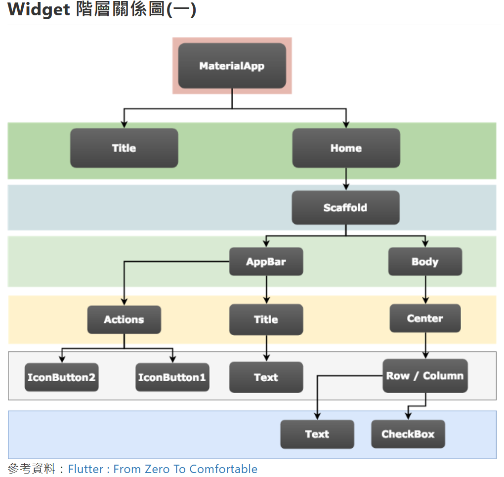
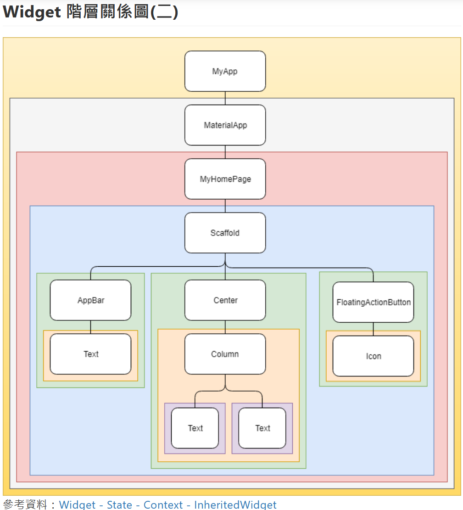

flutter 一切皆组件

<!-- 

`HOME` 分两个 `AppBar` 和 `Body`

```dart
import 'package:flutter/material.dart';

main() {
  runApp(MaterialApp(
    home: Scaffold(
      appBar: AppBar(
        title: Text('Who am i'),
      ),
      body: Center(
        child: Text('I\'m geo'),
      ),
    ),
  ));
}
```



整体框架 -->

```dart
import 'package:flutter/material.dart';

void main() {
  runApp(MyApp());
}

class MyApp extends StatelessWidget {
  @override
  Widget build(BuildContext context) {
    return MaterialApp(
        home: Scaffold(
      appBar: AppBar(
        title: Text('HKT線上教室'),
      ),
      body: HomePage(),
    ));
  }
}

class HomePage extends StatelessWidget {
  @override
  Widget build(BuildContext context) {
    return Center(
      child: Text("第一個APP"),
    );
  }
}
```

细分到 `Container` 大容器里不用 `Center`

```dart
class HomePage extends StatelessWidget {
  @override
  Widget build(BuildContext context) {
    // 在这边设置
    return Container();
  }
}
```

### color 屬性

color：設定背景顏色屬性。

三種設定顏色值的方式：

- 設定背景色為紅色

```
return Container(color: Colors.red);
```

- 使用 8 個 16 進制設定顏色

```
return Container(color: Color(0xFFFF0000));
```

- 使用 ARGB 設定顏色 (A,R,G,B)，第一個欄位為 Alpha 透明度

```
return Container(color: Color.fromARGB(255, 255, 00, 00));
```

### alignment 屬性

alignment：設定對齊方式屬性。

```dart
return Container(
  alignment:Alignment.center,
  child: Text('發大財'),
  color: Colors.amber,
);
```

```
Alignment.bottomCenter：置底中間
Alignment.bottomLeft：左下角
Alignment.center：正中間
Alignment.centerLeft：置左邊中間
Alignment.centerRight 置右中間
Alignment.topCenter：正上方中間
Alignment.topLeft：左上角
Alignment.topRight：右上角
```